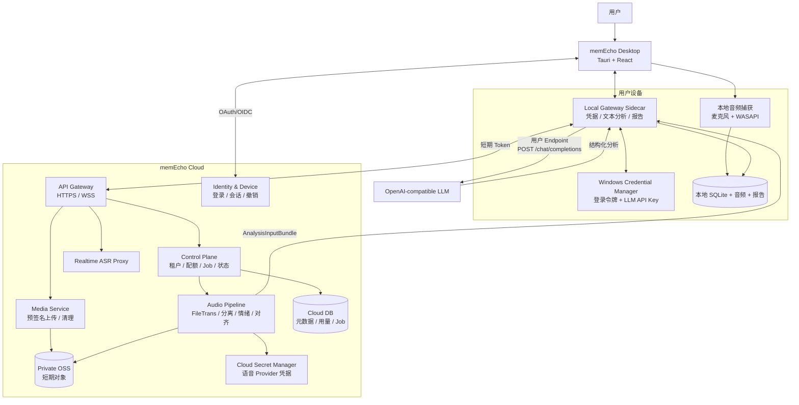
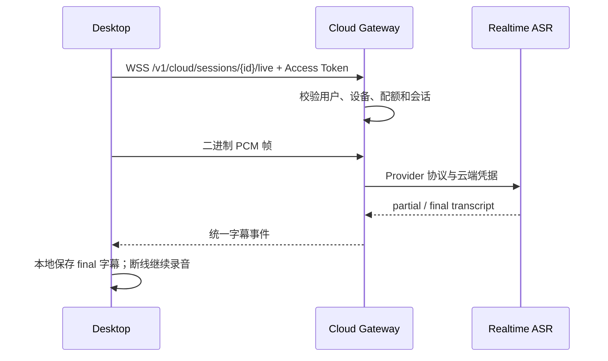

# memEcho Cloud 混合架构方案

> 文档状态：架构提案，尚未全部实现
>
> 版本定位：memEcho Cloud 试用版 / 商业版
>
> 基线日期：2026-09-17
>
> 适用客户端：Windows 桌面端；后续可扩展 macOS

## 1. 需求结论

目标是让普通用户下载安装后，不再配置 Gateway、实时字幕、FileTrans、说话人分离、情绪识别、OSS、Workspace 和语音模型。用户只需要：

1. 注册或登录；
2. 选择麦克风和系统声音；
3. 开始录音。

同时保留一项用户自有配置：**文本大模型分析使用 OpenAI API 兼容协议，由用户填写 Endpoint、Model 和 API Key。**

因此，产品承诺需要准确表述为：

> 录音、实时字幕和会后语音处理零配置；首次生成智能分析报告时，用户一次性配置自己的 OpenAI-compatible 文本模型。

“全部零配置”和“文本模型必须由用户自行填写 Key”不能同时严格成立。如果需要真正三步完成并直接生成报告，必须额外提供 memEcho 托管文本模型作为试用兜底；本方案将其定义为可选能力，不作为基础依赖。

## 2. 架构决策

| 决策 | 选择 | 原因 |
|---|---|---|
| 实时字幕与语音处理 | memEcho Cloud 托管 | 消除 Endpoint、Workspace、OSS 和多模型配置 |
| 文本分析 | 桌面 Sidecar 本地发起 OpenAI-compatible 请求 | 用户 Key 不经过 memEcho Cloud，支持公网、企业代理和本地模型 |
| 文本模型凭据 | Windows Credential Manager | 复用现有实现，不写入 JSON、SQLite、日志或云端 |
| OSS | Cloud 私有基础设施 | 客户端永远不获得 OSS 长期密钥 |
| Gateway | Cloud Gateway + 本地 Sidecar 双层 | Cloud 负责多租户语音数据面，本地 Sidecar 负责设备、凭据和报告 |
| 报告主副本 | 默认本地 | 延续本地优先；云同步作为显式可选项 |
| 用户身份 | OAuth 2.1 Authorization Code + PKCE / Device Flow | 桌面端不保存客户端密钥，支持设备撤销 |
| Cloud 访问凭据 | 短期 Access Token + 可轮换 Refresh Token | 替代固定 Gateway Token |
| 合同 | 版本化 `AnalysisInputBundle` 与现有报告 Schema | 云端音频处理和本地文本分析可独立演进 |

## 3. 总体架构



### 3.1 信任边界

- memEcho Cloud 可以接触用户明确上传的临时音频、转写、说话人和情绪结果。
- memEcho Cloud **不能接触用户的文本模型 API Key**。
- 用户配置的文本 Endpoint 由本地 Sidecar 直接访问；文本供应商将接收到用于分析的转写和证据包，界面必须明确告知数据去向。
- 桌面 WebView 不直接持有长期 Cloud Token、LLM Key 或 OSS 密钥。
- OSS 对象始终私有；客户端只获得单对象、短时、受动作限制的上传 URL。

## 4. 用户体验

### 4.1 首次启动

```text
欢迎页
  → 登录 / 注册
  → 麦克风与系统声音检测
  → 进入录音页
```

不显示以下字段：Gateway URL、Gateway Token、Realtime Endpoint、FileTrans Endpoint、Workspace ID、OSS、语音模型名称。

### 4.2 首次文本分析

用户第一次点击“生成分析”时，如果还没有文本模型配置，显示一个最小表单：

```text
服务商预设：[OpenAI / 阿里云兼容 / DeepSeek / 自定义]
Endpoint：   [自动填充，可修改]
Model：      [自动填充，可修改]
API Key：    [••••••••••••••••]

[测试并保存] [暂不分析，仅保存逐字稿]
```

保存后，后续会话不再询问。高级设置允许切换多个文本模型 Profile。

### 4.3 可选的真正零配置试用

若商业目标要求用户不填写任何 Key 就看到完整报告，可增加受配额约束的 `memEcho Trial LLM`：

- 每个账号赠送有限分析分钟数；
- Cloud 使用托管文本模型；
- 超出额度后引导用户购买套餐或切换 BYOK；
- 该模式和本地 BYOK 使用同一报告合同，不影响后续切换。

## 5. 数据流

### 5.1 实时字幕



要求：

- WSS 只接收短期 Access Token，不接收固定 Gateway Token；
- Cloud 屏蔽 Workspace、Endpoint 和 Provider 模型；
- 断线后按 `session_id + sequence` 恢复，禁止重复字幕；
- Cloud 不把上游原始错误正文直接返回客户端。

### 5.2 正式会后处理

```text
本地双轨 WAV
  → Cloud 获取上传意图
  → 客户端直传私有 OSS（预签名 PUT）
  → Cloud 创建 Audio Job
  → FileTrans 异步轮询
  → 说话人分离 / 情绪 / 声学质量
  → 证据对齐
  → 生成 AnalysisInputBundle
  → 客户端下载 Bundle
  → 本地 Sidecar 调用用户 OpenAI-compatible Endpoint
  → 合同校验
  → 本地保存 JSON / Markdown / HTML 报告
  → Cloud 删除临时对象
```

### 5.3 文本分析

本地 Sidecar 调用：

```http
POST {endpoint}/chat/completions
Authorization: Bearer {user_api_key}
Content-Type: application/json
```

请求使用 OpenAI Chat Completions 兼容结构。第一阶段不依赖供应商专有 SDK：

```json
{
  "model": "user-selected-model",
  "messages": [
    {"role": "system", "content": "memEcho analysis contract ..."},
    {"role": "user", "content": "<versioned AnalysisInputBundle>"}
  ],
  "response_format": {"type": "json_object"},
  "temperature": 0.2
}
```

兼容性分级：

1. 基础：支持 `/chat/completions` 与 Bearer Token；
2. 推荐：支持 JSON mode；
3. 完整：支持 JSON Schema structured output；
4. 降级：模型返回文本 JSON 时执行严格解析与一次修复请求；仍不合法则失败，不伪造报告。

## 6. AnalysisInputBundle 合同

Cloud 不直接生成最终报告，而是返回一个可审计输入包：

```json
{
  "schema_version": "1.0",
  "session_id": "ses_xxx",
  "language": "zh-CN",
  "duration_ms": 3600000,
  "transcript_segments": [],
  "participants": [],
  "emotion_segments": [],
  "acoustic_metrics": [],
  "evidence": [],
  "quality": {
    "transcription": 0.95,
    "alignment": 0.88,
    "missing_signals": []
  },
  "provenance": {
    "audio_pipeline_version": "...",
    "created_at": "..."
  }
}
```

合同要求：

- 每个可引用片段具有稳定 `evidence_id`；
- 文本、说话人、情绪和声学结果均携带来源与置信度；
- 缺失轨道必须显式列入 `missing_signals`；
- Bundle 使用版本字段，Cloud 和桌面端支持至少前一版本；
- 最终报告中的事实主张必须引用 Bundle 中的证据 ID。

## 7. Cloud 服务拆分

初期不建议拆成大量微服务。采用模块化单体 + 独立 Worker，可降低运维复杂度：

```text
cloud/
├── api/                 # 登录回调、Session、Job、Bundle API
├── realtime-worker/     # 长连接实时字幕代理，可独立扩容
├── audio-worker/        # FileTrans、分离、情绪、对齐
├── media/               # 预签名 URL、对象生命周期
├── providers/           # 云端语音 Provider Adapter
├── billing/             # 配额、用量、试用额度
└── contracts/           # Cloud API / Bundle 合同
```

建议部署单元：

| 单元 | 是否有状态 | 扩容依据 |
|---|---|---|
| Cloud API | 无状态 | HTTP QPS |
| Realtime Worker | 连接状态 | 并发 WSS、音频带宽 |
| Audio Worker | Job 状态在 DB | 待处理音频分钟数 |
| PostgreSQL | 有状态 | 租户、Session、Job、用量 |
| Redis | 短期状态 | 限流、游标、Worker 协调 |
| OSS | 临时媒体 | 上传量和生命周期 |

## 8. Cloud API 草案

| 接口 | 用途 |
|---|---|
| `POST /v1/auth/device` | 发起设备登录 |
| `POST /v1/auth/token` | 交换/刷新短期 Token |
| `GET /v1/me` | 当前用户、套餐和剩余额度 |
| `POST /v1/cloud/sessions` | 创建云端会话 |
| `WS /v1/cloud/sessions/{id}/live` | 实时 PCM 与字幕 |
| `POST /v1/cloud/sessions/{id}/uploads` | 创建预签名上传 |
| `POST /v1/cloud/sessions/{id}/audio-jobs` | 幂等启动语音处理 |
| `GET /v1/cloud/jobs/{id}` | 任务快照 |
| `GET /v1/cloud/jobs/{id}/events` | SSE 状态和恢复游标 |
| `GET /v1/cloud/sessions/{id}/analysis-input` | 下载版本化 Bundle |
| `DELETE /v1/cloud/sessions/{id}/media` | 主动清理临时媒体 |
| `GET /v1/cloud/usage` | 试用和付费额度 |

所有副作用接口必须支持 `Idempotency-Key`。所有资源 ID 必须同时校验租户所有权，禁止只凭 ID 查询。

## 9. 身份、设备与令牌

### 9.1 登录

- 桌面端使用系统浏览器完成 OAuth 2.1 Authorization Code + PKCE；
- 无浏览器回调环境可以使用 Device Authorization Flow；
- Refresh Token 保存到 Windows Credential Manager；
- Access Token 仅保存在进程内存中，建议 10～15 分钟有效；
- 用户可以在账户中心查看和撤销设备。

### 9.2 本地 Sidecar 授权

- Tauri 启动 Sidecar 时继续使用每次启动随机生成的本地一次性 Token；
- Cloud Token 由 Tauri IPC 传给 Sidecar 内存，不写 `.env`；
- Sidecar 调用 Cloud 时携带用户短期 Token和设备标识；
- 前端不能自行指定任意 Cloud Gateway URL，生产版本使用签名环境配置。

## 10. 凭据管理

### 10.1 用户文本模型

本地保存：

- `text_endpoint`、`text_model`：非敏感，可写入本地 Profile JSON；
- `api_key`：仅写入 Windows Credential Manager；
- Cloud 只知道用户选择了 `local_byok`，不知道 Endpoint 和 Key；
- 日志只记录 Profile ID、响应状态、耗时和稳定错误码。

### 10.2 Cloud 语音模型和 OSS

- 语音 Provider、OSS 和数据库凭据进入云密钥管理系统；
- Worker 使用工作负载身份或短期凭据读取；
- 不写入容器镜像、桌面安装包、仓库或普通环境导出文件；
- 定期轮换并支持按租户或环境隔离。

## 11. OSS 与媒体生命周期

- Bucket 必须私有；禁止公共读。
- 对象路径使用 `tenant_hash/session_uuid/random_track_id`，不包含姓名和会议标题。
- 客户端只获取限时 PUT URL，Audio Worker 使用服务身份读取。
- 成功完成 Bundle 后立即删除音频对象。
- 失败任务最多保留 24 小时供幂等重试。
- Bucket 生命周期规则对临时前缀执行 1 天强制删除，作为异常兜底。
- 试用账号限制总分钟数、单次时长、并发会话和每日上传量。

## 12. 多租户数据模型

Cloud 最小数据表：

- `users`：身份主体和状态；
- `tenants`、`memberships`：个人与团队空间；
- `devices`：设备、公钥、撤销状态和最后使用时间；
- `cloud_sessions`：租户、状态、时长、保留策略；
- `media_objects`：对象引用、校验和、轨道、删除状态；
- `jobs`、`job_steps`：幂等键、状态、上游任务 ID、重试；
- `analysis_bundles`：合同版本、校验和和对象引用；
- `usage_ledger`：实时分钟、转写分钟、上传字节和试用扣减；
- `audit_events`：登录、设备、配置和删除审计。

Cloud 默认不保存最终报告正文；如果未来提供同步功能，应使用独立开关和清晰的数据保留政策。

## 13. 现有实现复用与缺口

| 现有能力 | 复用方式 | 目标缺口 |
|---|---|---|
| Tauri 双轨录音与 WASAPI | 直接复用 | 增加 Cloud Session 和断线续传 |
| Gateway Sidecar Supervisor | 继续负责本地凭据和报告 | 增加 Cloud Token 注入与 Cloud Client |
| Windows Credential Manager | 保存 LLM Key 和 Refresh Token | 区分登录凭据与 Provider 凭据 |
| `openai_compatible` Provider | 作为本地文本分析适配器 | 从当前单一 Profile 中拆出独立 Text Profile |
| FileTrans 异步轮询 | 移入 Cloud Audio Worker | 增加租户、队列、幂等与横向扩容 |
| OSS Provider | 移入 Cloud Media Service | 改为预签名直传和服务身份读取 |
| Processing Details | 映射 Cloud Job 事件 | 增加跨重启 SSE 游标和 Cloud 错误码 |
| 报告合同与证据引用 | 继续作为最终输出合同 | 新增 `AnalysisInputBundle` 合同 |
| Provider Profile UI | 简化为文本分析设置 | 隐藏全部云端语音字段 |

当前 Profile 将语音能力和文本分析绑定在同一个 `provider_profile_id`。Cloud 版本必须拆成：

```text
cloud_audio_profile = 由服务端按套餐和地域选择，用户不可见
local_text_profile  = 用户配置的 OpenAI-compatible Endpoint / Model / Key
```

否则会继续要求用户填写语音模型和 Workspace，违背零配置目标。

## 14. 状态机

```text
local_recording
→ cloud_uploading
→ cloud_audio_processing
→ analysis_bundle_ready
→ local_llm_config_required   # 仅首次未配置时
→ local_text_analyzing
→ local_contract_validating
→ complete
```

并行的实时字幕状态：

```text
connecting → connected → reconnecting → closed
```

实时字幕失败不得终止本地录音。文本分析失败不得删除 Bundle、逐字稿或本地音频，用户可以更换 Endpoint 后仅重试文本分析，不重复产生 FileTrans 费用。

## 15. 稳定错误码与用户动作

| 错误码 | 用户文案 | 动作 |
|---|---|---|
| `cloud_auth_required` | 登录状态已失效 | 重新登录 |
| `trial_quota_exhausted` | 免费额度已用完 | 购买套餐或稍后再试 |
| `cloud_realtime_unavailable` | 实时字幕暂时不可用，本地录音继续 | 自动重连 |
| `cloud_audio_failed` | 云端语音处理失败 | 使用原 Job 重试 |
| `local_llm_not_configured` | 请配置文本分析服务 | 打开最小配置表单 |
| `local_llm_auth_failed` | 文本模型密钥无效 | 更新本机 Key |
| `local_llm_endpoint_unreachable` | 无法连接文本模型 Endpoint | 检查地址、网络或代理 |
| `local_llm_contract_invalid` | 模型没有返回有效结构 | 更换模型或重试修复 |
| `bundle_version_unsupported` | 客户端版本过旧 | 升级桌面端 |

## 16. 安全与合规要求

- 使用 HTTPS/WSS，服务端启用 HSTS；
- Token 具有 audience、device、tenant 和 scope；
- Cloud API 执行租户级授权、速率限制和审计；
- 预签名 URL 限制对象、动作、大小、类型和有效期；
- 上传后重新校验 WAV 格式、大小、时长和校验和；
- 禁止 Cloud 按用户输入 URL 抓取媒体，避免 SSRF；
- 用户自定义文本 Endpoint 仅由本地 Sidecar访问；公网 Endpoint 要求 HTTPS，HTTP 仅允许 localhost；
- 日志不得记录音频、完整逐字稿、报告正文、Token、API Key、签名 URL；
- 用户在上传前看到数据用途和保留期，并能主动删除；
- Cloud Provider、区域和数据跨境情况必须在隐私说明中披露。

## 17. 成本与滥用控制

试用期主要成本来自 ASR/FileTrans/语音模型，OSS 只是临时传输层。必须实施：

- 每账号试用总分钟数；
- 单次会话最长时长；
- 每设备和每账号并发限制；
- 每日上传字节与任务数限制；
- 手机号、账号、设备和风险 IP 的组合防刷；
- 成功立即删除 OSS，失败最多保留 24 小时；
- 预算告警、租户熔断和 Provider 费用看板；
- Job 幂等，重试不得重复提交付费 FileTrans 任务。

## 18. 分阶段实施

### 阶段 A：合同与职责拆分

1. 定义并生成 `AnalysisInputBundle` Python/TypeScript 合同。
2. 将 Session 的单一 Provider Profile 拆为 Cloud Audio 与 Local Text 两个职责。
3. 把现有 `openai_compatible` 调用封装为独立本地 Text Analyzer。
4. 为报告合同校验和证据引用增加测试。

### 阶段 B：Cloud 最小闭环

1. 增加登录、设备、短期 Token 和租户模型。
2. 建立 Cloud Session、Job、Usage 和 SSE API。
3. 将 OSS、FileTrans、说话人分离、情绪和对齐部署到 Audio Worker。
4. 返回 Bundle，不在 Cloud 保存用户 LLM Key。

### 阶段 C：桌面产品化

1. 增加登录和首次启动向导。
2. 默认使用固定 memEcho Cloud 地址，隐藏 Gateway 设置。
3. 增加最小 OpenAI-compatible 文本配置表单和服务商预设。
4. 增加本地分析重试、Endpoint 测试和合同错误反馈。

### 阶段 D：试用、计费与运维

1. 配额账本、试用额度和限流。
2. OSS 生命周期、成本看板和预算熔断。
3. 诊断包、Trace ID、脱敏日志和支持后台。
4. 灰度发布、协议版本门禁和客户端强制升级策略。

### 阶段 E：企业与开源兼容

1. 保留现有本地/自托管模式。
2. 企业可以替换 Cloud Base URL 并通过组织策略下发。
3. 支持本地 OpenAI-compatible 模型，如 Ollama/LM Studio 代理。
4. Cloud、本地和企业模式共用合同与报告 UI。

## 19. 验收标准

### 普通用户

- 新机器安装后不复制 `.env`、`provider_profiles.json` 或 Gateway Token；
- 登录后即可录音并看到真实实时字幕；
- 会后语音处理不要求 OSS、Workspace 或语音模型配置；
- 未配置文本模型时仍可查看正式逐字稿，并得到明确的一次性配置入口；
- 配置 Endpoint、Model、Key 后可生成正式报告；
- 后续会话无需再次填写文本模型配置。

### 安全

- 桌面安装包和 Cloud API 响应均不包含长期 OSS、语音 Provider 或用户 LLM 密钥；
- 用户 LLM Key 不离开设备，只存在系统凭据库；
- Cloud 媒体对象均为私有、短期并可审计删除；
- 不同租户不能枚举或访问彼此的 Session、Job、Bundle 和媒体。

### 可靠性

- 实时字幕断线时本地录音继续；
- Cloud Job 重启后继续轮询，不重复计费提交；
- Cloud 处理完成后可独立重试本地文本分析；
- 客户端、Cloud 和 Bundle 版本不兼容时返回稳定错误码；
- 每一步都显示真实状态，不用固定进度假装完成。

## 20. 不建议的方案

以下方案不得采用：

- 把 OSS、语音模型或公共 LLM Key写入 EXE；
- 将一个生产 Key 分发给所有客户端；
- 让客户端长期持有 OSS AccessKey；
- 将用户 BYOK Key 上传到 Cloud 只为简化实现；
- 继续要求普通用户复制 `.env` 和 Provider Profile；
- Cloud 直接保存完整报告和逐字稿却没有明确开关与保留政策；
- 为了“零配置”把 Mock、静态字幕或伪造分析用于正式用户。

## 21. 最终建议

推荐产品形态是：

> **Cloud 托管语音链路，本地 BYOK 负责文本分析，本地保存最终报告。**

该方案最大限度复用现有 Sidecar、Credential Manager、OpenAI-compatible Provider、FileTrans 轮询和报告合同，同时真正消除客户当前最困难的 Gateway、OSS、Workspace 和语音模型配置。若需要完整零配置体验，再增加有严格试用额度的托管文本模型，而不是把共享密钥打入安装包。
