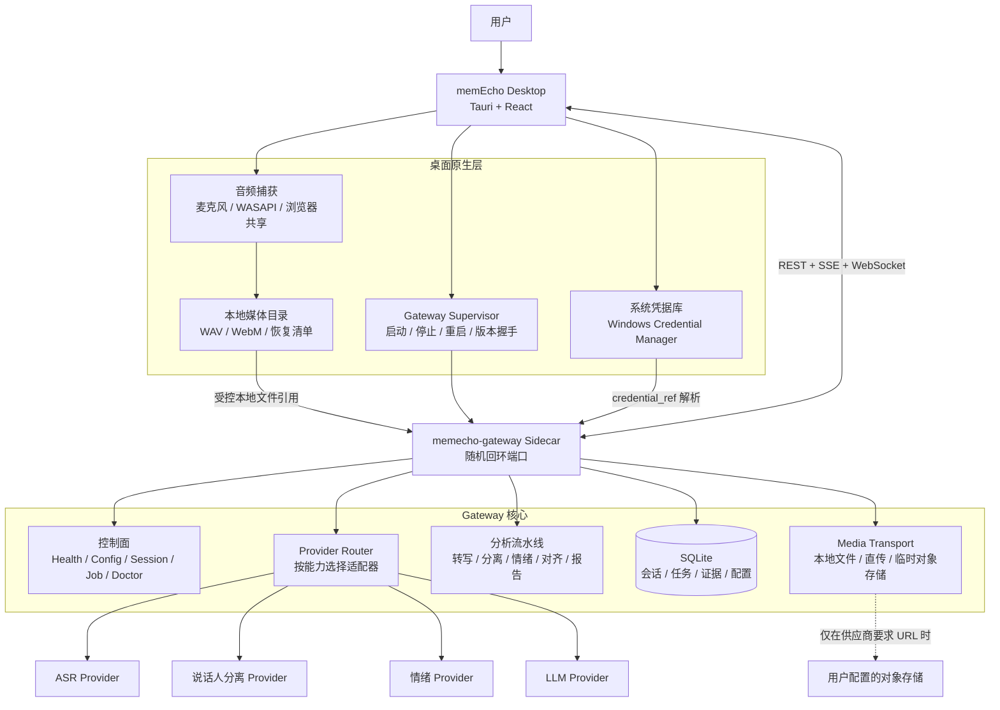
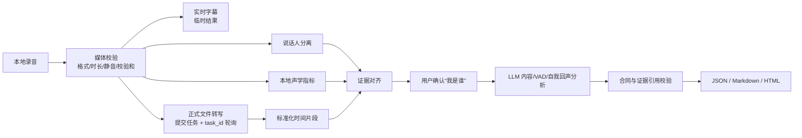

# memEcho 开源版架构方案

> 版本名称：**开源版**  
> 文档状态：目标架构，待分阶段实施  
> 适用范围：Windows 桌面端、本地开发、自托管 Gateway、第三方 Provider 扩展

## 1. 产品定位

memEcho 开源版是一套本地优先、用户自带密钥（BYOK）、可替换 AI 服务的对话分析产品。用户下载安装后，应能在界面内完成模型配置、录音、实时字幕、会后转写、说话人确认、VAD 分析和报告生成，不需要手工安装 Python、编辑 `.env` 或运行 PowerShell 启动 Gateway。

开源版不绑定百炼、OSS 或某个固定模型。百炼是首个官方适配器，其他兼容服务可以通过 Provider Adapter 接入。

## 2. 架构原则

1. **本地优先**：音频、逐字稿、报告和记忆默认保存在用户设备。
2. **Gateway 随应用启动**：桌面端管理本地 Sidecar，不要求用户手工启动后台服务。
3. **BYOK**：用户在产品界面配置自己的 ASR、说话人分离、情绪和 LLM 凭据。
4. **能力驱动**：业务只依赖 `realtime_asr`、`file_transcription` 等能力，不依赖供应商名称。
5. **OSS 可选**：只有上游 API 明确要求公网 URL 时才使用对象存储。
6. **控制面和数据面分离**：状态与命令走 HTTP/WebSocket/SSE；音频走本地文件、二进制流或分块上传。
7. **证据可追溯**：正式结论必须引用时间片段或证据 ID，并标识 observed、computed、interpreted。
8. **安全降级**：上游失败时保留录音和已完成产物，不伪造转写、情绪或声学结论。

## 3. 总体架构



## 4. 运行模式

### 4.1 桌面 Sidecar 模式（默认）

- 安装包内携带版本匹配的 `memecho-gateway` 可执行文件。
- Tauri 启动 Gateway，Gateway 自动选择空闲的 `127.0.0.1` 端口。
- Gateway 将端口、版本、协议版本和一次性启动凭据通过标准输出或命名管道返回。
- 前端不能从构建变量读取固定 Token，也不能把 Token放在 URL 查询参数中。
- 桌面端退出时优雅终止 Sidecar；未结束任务写入恢复清单。

这是普通用户的标准运行方式。

### 4.2 独立 Gateway 模式（可选）

面向开发者、团队和自托管用户，提供：

```text
memecho gateway serve
memecho gateway install
memecho gateway status
memecho gateway restart
memecho gateway stop
memecho doctor
```

独立模式可以监听局域网或 HTTPS 地址，但必须显式开启远程访问并配置强认证。默认仍只监听回环地址。

### 4.3 开发模式

- 前端 Vite、Tauri 和 Gateway 可以分别运行。
- 允许开发者指定固定端口。
- Mock Provider 与真实 Provider 必须显式区分；界面持续显示当前运行模式。

## 5. Gateway 分层

### 5.1 进程与控制面

负责：

- 健康检查、版本与协议握手；
- Provider 配置和能力探测；
- Session、Job、重试、取消和恢复；
- SSE/WebSocket 进度事件；
- 日志导出和脱敏诊断；
- 配置校验、原子更新和热加载。

Gateway 应保留最后一份有效配置。配置更新校验失败时，不替换正在运行的配置。

### 5.2 Provider Router

每个 Provider 通过统一清单声明能力：

```yaml
id: bailian
display_name: Alibaba Cloud Model Studio
adapter_version: 1
auth_fields:
  - api_key
capabilities:
  - realtime_asr
  - file_transcription
  - diarization
  - audio_emotion
  - text_analysis
media_inputs:
  - public_url
  - binary_upload
config_schema: provider.schema.json
```

业务流水线只请求能力，例如“选择一个支持 `file_transcription` 和 `public_url` 的 Profile”，不在业务代码中判断 `provider == bailian`。

首批适配器建议包括：

| 类型 | 官方适配器 | 扩展方向 |
|---|---|---|
| 实时 ASR | 百炼 Qwen Realtime | OpenAI-compatible、本地 ASR |
| 文件转写 | 百炼 FileTrans | 可直接上传文件的 API、本地模型 |
| 说话人分离 | 百炼 Fun-ASR | 独立 diarization 服务、本地模型 |
| 情绪 | 百炼音频情绪 | 文本 VAD、本地声学模型 |
| LLM | 百炼 Qwen | OpenAI-compatible、Ollama、LM Studio |

### 5.3 媒体传输层

媒体输入必须从 Provider 能力中选择，不再固定依赖 OSS：

1. `local_path`：本地模型或本地 Gateway 直接读取。
2. `binary_upload`：Gateway 把文件直接上传到供应商 API。
3. `base64_inline`：只用于供应商允许且体积受限的小文件。
4. `public_url`：供应商强制要求 URL 时，使用用户配置的临时对象存储。

对象存储是 Media Transport 插件，不是业务核心。支持 OSS、S3 兼容服务或其他临时文件服务。对象必须使用随机路径、短有效期签名 URL，并在任务完成、失败或取消后删除。

### 5.4 分析流水线



实时字幕是临时产物，不能替代正式 FileTrans。FileTrans 必须实现：

```text
submitted → polling → downloading → parsing → completed
                                  └→ failed / timeout / cancelled
```

任务需要持久化上游 `task_id`、轮询次数、下一次轮询时间和最后稳定错误码。Gateway 重启后可以继续轮询，而不是重新提交付费任务。

## 6. Provider Profile 与密钥

### 6.1 Profile

用户可以创建多个配置档案，例如：

- “百炼个人账号”；
- “公司 OpenAI-compatible Gateway”；
- “本地 Ollama”；
- “本地 ASR + 云端 LLM”。

一个会话记录使用的 `provider_profile_id` 和模型版本，以保证报告可以审计和重试。

### 6.2 密钥存储

- API Key 保存到 Windows Credential Manager；以后扩展 macOS Keychain 和 Linux Secret Service。
- SQLite 只保存 `credential_ref`，不保存明文。
- React 状态、日志、URL、导出报告和任务事件中不得出现密钥。
- Gateway 只在发起供应商请求时解析密钥，并对错误正文做脱敏。
- `.env` 只用于开发和无桌面环境的自托管模式，不是普通用户的配置入口。

### 6.3 Profile 绑定规则

创建 Session 时冻结本次使用的 Profile 快照，但不复制密钥。暂停、身份确认、重试和恢复都必须继续引用同一 Profile，避免实时字幕与会后分析使用不同账号。

### 6.4 可编辑配置文件

- 桌面 Sidecar 将非敏感 Profile 同步到 `%APPDATA%\memEcho\sessions\gateway\provider_profiles.json`。
- 界面创建、更新和删除 Profile 时原子更新该文件；用户也可点击“打开配置文件”直接编辑。
- 手工保存后点击“重新载入文件”完成结构校验并同步到 Gateway；无效 JSON 不覆盖当前有效配置。
- 文件仅包含 Endpoint、模型、Workspace、能力和 `credential_ref`，不得包含 API Key 明文。
- 删除仍被 Session 引用的 Profile 会被拒绝，避免破坏既有会话的可审计性。

## 7. API 与事件合同

Pydantic/OpenAPI 是 HTTP 合同的唯一来源，桌面 TypeScript SDK 自动生成。建议核心接口：

| 接口 | 用途 |
|---|---|
| `GET /v1/health` | 进程、版本和基础健康 |
| `GET /v1/capabilities` | Gateway 与 Provider 能力 |
| `GET/POST/PATCH /v1/provider-profiles` | Provider Profile 管理 |
| `GET /v1/provider-profiles/config` | 可编辑配置文件位置和状态 |
| `POST /v1/provider-profiles/config/reload` | 校验并重新载入配置文件 |
| `POST /v1/provider-profiles/{id}/verify` | 鉴权和能力探测 |
| `POST /v1/sessions` | 创建会话并绑定 Profile |
| `WS /v1/sessions/{id}/live` | 二进制 PCM 与实时字幕事件 |
| `POST /v1/sessions/{id}/uploads` | 文件或分块上传 |
| `POST /v1/sessions/{id}/analyze` | 幂等启动分析 |
| `GET /v1/jobs/{id}` | 任务快照 |
| `GET /v1/jobs/{id}/events` | SSE 进度与恢复游标 |
| `GET /v1/sessions/{id}/processing-details` | 分模块进度和稳定错误码 |
| `GET /v1/sessions/{id}/result` | 合同结果与本地报告 |
| `GET /v1/doctor` | 脱敏诊断结果 |

所有产生副作用的请求必须支持 `request_id` 或幂等键。

## 8. 统一任务状态

顶层任务状态：

```text
queued
→ capturing
→ uploaded
→ transcribing
→ awaiting_identity
→ aligning
→ analyzing
→ rendering
→ complete
```

终止状态为 `failed`、`cancelled`、`insufficient`。每个子模块单独维护状态，避免一个静音麦克风轨掩盖系统音频轨已经成功的事实。

错误对用户显示稳定错误码和可执行建议，例如：

| 错误码 | 含义 | 用户动作 |
|---|---|---|
| `provider_auth_failed` | Provider 凭据无效 | 回到 Profile 重新验证 |
| `media_input_unsupported` | 当前 Provider 不接受该媒体方式 | 更换 Provider 或启用临时存储 |
| `upstream_task_failed` | 上游异步任务失败 | 查看脱敏详情并重试 |
| `upstream_timeout` | 轮询超时但任务可能仍在运行 | 稍后继续轮询，不重复提交 |
| `insufficient_evidence` | 无有效文本或声学证据 | 检查录音源或导入文本 |

## 9. 本地数据模型

SQLite 至少包含：

- `sessions`：标题、场景、状态、来源和 Profile；
- `media_assets`：本地相对路径、校验和、轨道、生命周期；
- `participants`：说话人标签、用户确认身份；
- `transcript_segments`：时间戳、文本、说话人、置信度；
- `evidence`：来源、时间范围和类型；
- `jobs` 与 `job_steps`：状态、幂等键、上游任务引用；
- `analyses` 与 `reports`：合同版本和文件位置；
- `provider_profiles`：非敏感配置和 `credential_ref`；
- `memory_candidates`：待确认记忆及来源关系。

删除 Session 必须级联删除本地媒体、逐字稿、报告和依赖该来源的记忆；外部临时对象执行尽力删除和延迟清理兜底。

## 10. 插件与扩展边界

开源版第一阶段使用仓库内置 Adapter，稳定后再开放第三方插件。插件不得直接操作 UI、SQLite 或系统密钥库，只能通过受限接口获得：

- 脱敏后的 Provider 配置；
- 任务范围内的短期凭据句柄；
- 受控媒体输入；
- 结构化输出合同；
- 有界网络和超时策略。

Provider 插件需要声明许可证、网络域名、数据去向、所需权限和是否会保留用户内容。

## 11. 安全模型

- 默认绑定 `127.0.0.1`，禁止默认监听 `0.0.0.0`。
- 每次 Sidecar 启动生成新的本地访问凭据。
- 严格限制 CORS 和 WebSocket Origin。
- URL 媒体下载实施 SSRF 防护，默认拒绝环回、链路本地和私有网段。
- 日志只记录任务 ID、Provider ID、耗时、模型版本和稳定错误码。
- 不记录音频、逐字稿、报告正文、姓名、API Key 或完整上游响应。
- 远程 Gateway 使用 HTTPS/WSS、强认证和显式设备授权。
- 插件和配置变更具有来源、版本和校验记录。

## 12. 开源交付结构

```text
memecho-desktop/
├── apps/
│   └── desktop/                 # Tauri + React
├── services/
│   └── gateway/                 # Gateway 核心与 Provider Router
├── packages/
│   ├── contracts/               # OpenAPI / 分析合同
│   ├── provider-sdk/            # Provider Adapter SDK
│   └── ui/                      # 可复用 UI
├── providers/
│   ├── bailian/
│   ├── openai-compatible/
│   └── local/
├── infra/                       # 可选自托管模板
├── scripts/                     # 构建、发布、doctor
├── docs/
│   ├── open-source-edition/
│   └── v0.1.0/                 # 历史路演版文档
└── tests/
    ├── fixtures/
    ├── integration/
    └── smoke/
```

发布物应包含桌面安装包、Gateway Sidecar、许可证、第三方声明、配置说明和脱敏测试样例，不包含 `.env`、凭据、用户数据、缓存或开发 Agent 文件。

## 13. 与 v0.1.0 的迁移

### 阶段一：解除手工 Gateway 启动

1. 将 Python Gateway 打包成独立 Sidecar 可执行文件。
2. Tauri 实现启动、停止、随机端口、健康检查和版本握手。
3. 移除生产客户端中的固定 `127.0.0.1:8787` 与 `change-me`。
4. 保留开发模式固定端口开关。

### 阶段二：实现 BYOK

1. 建立 Provider Profile 模型和设置页面。
2. 使用 Windows Credential Manager 保存密钥。
3. 实时字幕、FileTrans、说话人分离、情绪和 LLM 都从 Session Profile 解析凭据。
4. 支持连接测试和能力探测。

### 阶段三：解除 OSS 强依赖

1. 抽象 Media Transport。
2. 优先支持供应商直接二进制上传。
3. 保留 OSS 为百炼 `public_url` 模式的可选插件。
4. 为本地 Provider 提供 `local_path`。

### 阶段四：Provider 化

1. 从现有百炼代码提取能力适配器。
2. 增加 OpenAI-compatible LLM Adapter。
3. 增加本地模型 Adapter 示例。
4. 发布 Provider SDK、合同测试和兼容性清单。

### 阶段五：自托管与社区发布

1. 增加 Headless Gateway 服务管理命令。
2. 提供 Docker 与反向代理模板。
3. 增加升级、迁移、诊断包和崩溃恢复。
4. 建立插件审查和安全披露流程。

## 14. 开源版验收标准

- 新用户只安装 memEcho 即可打开应用，Gateway 自动可用。
- 用户可以在界面内新增、验证、切换和删除 Provider Profile。
- API Key 不出现在仓库、日志、前端存储或导出文件中。
- 不配置 OSS 时，至少有一条正式转写和分析链路可以完整运行。
- 需要公网 URL 的 Provider 会明确提示配置临时存储，而不是统一报 `upstream_task_failed`。
- 实时字幕断线不影响本地录音；恢复后不丢失正式会后分析。
- FileTrans 异步任务可观察、可恢复、不会因重启重复计费提交。
- 每个流水线步骤在界面显示状态、耗时、证据数量和稳定错误码。
- 删除会话后，本地媒体、报告和派生记忆按来源清理。
- Mock、开发和真实 Provider 模式在界面上清晰可辨。
- Windows 安装包不依赖用户预装 Python、Node.js 或 PowerShell 脚本。

## 15. 架构决策摘要

| 决策 | 选择 |
|---|---|
| 默认 Gateway 形态 | 随桌面端启动的本地 Sidecar |
| 高级运行形态 | 可选 Headless/自托管 Gateway |
| 客户端通信 | REST + SSE + WebSocket，合同生成 SDK |
| 密钥归属 | 操作系统凭据库，Gateway 使用引用解析 |
| Provider 选择 | 能力驱动的 Profile 与 Adapter |
| OSS | 可选 Media Transport，不是核心依赖 |
| 数据默认位置 | 用户本地设备 |
| 后台任务 | SQLite 持久化、幂等、可恢复 |
| 插件策略 | 先内置 Adapter，后开放受限 SDK |
| 历史版本 | `docs/v0.1.0/` 保留为路演版实现记录 |
